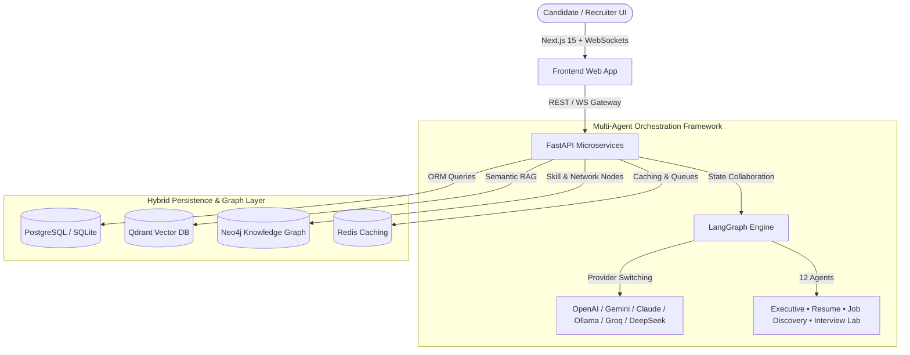

# REDROB AI OS — The Autonomous AI Career Operating System

> **Transforming Redrob into an intelligent, AI-native career ecosystem powered by 12 autonomous background agents.**

This is not a traditional CRUD job portal. Redrob is an AI-first SaaS platform where candidates and recruiters delegate continuous career workflows to autonomous AI agents working 24x7 in the background.

---

## 🚀 Key Platform Highlights

- **12 Autonomous AI Agents**: Executive, Career Coach, Resume Optimizer, Skill Gap, Job Discovery, Recruiter Suite, Networking, Mock Interview, Learning, Salary Intelligence, Career Forecast agents, and a 24x7 Opportunity Monitor daemon.
- **Dynamic Multi-Provider AI Engine**: Unified failover supporting OpenAI, Gemini, Claude, local Ollama, Groq, and DeepSeek models with runtime provider switching.
- **Hybrid Data Architecture**: PostgreSQL for transactional data, Qdrant vector database for semantic match RAG retrieval, and Neo4j Knowledge Graph for skill node dependency mapping.
- **Modern Dark-Mode Glassmorphism UI**: Built with Next.js 15, React 19, Framer Motion, and Tailwind CSS.
- **Real-Time Telemetry**: Instant WebSocket & SSE gateways streaming active agent reasoning logs, interview audio analysis, and live market alerts.

---

## 🏗️ System Architecture



---

## 🤖 12 Autonomous AI Agents Breakdown

| Agent | Responsibility |
| :--- | :--- |
| **Executive Agent** | Orchestrates global workflows, assigns career goals, and maintains long-term user memory. |
| **Career Coach Agent** | Generates 12-month career roadmaps and predicts long-term trajectory milestones. |
| **Resume Agent** | Real-time ATS scoring, keyword optimization, and bullet point rewriting engine. |
| **Skill Gap Agent** | Compares profile against target roles and detects missing skill proficiencies. |
| **Job Discovery Agent** | Scans thousands of connected job portals and auto-saves top matched opportunities. |
| **Recruiter Agent** | Multi-signal candidate ranking, resume scoring, and hiring analytics. |
| **Networking Agent** | Suggests mentors, peers, alumni, and recruiters based on graph node connections. |
| **Interview Agent** | Simulates voice, coding, and behavioral mock interviews with sentiment analysis. |
| **Learning Agent** | Curates personalized course roadmaps, YouTube tutorials, and gamified XP tracking. |
| **Salary Intelligence Agent** | Predicts salary benchmarks and provides personalized negotiation scripts. |
| **Career Forecast Agent** | Simulates promotion odds, job switch windows, and skill resilience indexes. |
| **Opportunity Monitor (24x7)** | Background daemon scanning hackathons, freelance contracts, and urgent jobs. |

---

## 📡 Key API Documentation

| Endpoint | Method | Description |
| :--- | :--- | :--- |
| `/api/agents/chat` | `POST` | Interactive agent chat with multi-provider LLM selection |
| `/api/agents/orchestrate` | `POST` | Execute full executive onboarding career workflow |
| `/api/agents/opportunity-monitor`| `GET` | Sweep global portals for hackathons, freelance, and jobs |
| `/api/agents/interview/evaluate` | `POST` | Evaluate candidate mock interview answers for sentiment & clarity |
| `/api/agents/salary-intelligence` | `GET` | Compute median benchmarks and generate negotiation scripts |
| `/api/agents/forecast` | `GET` | Predict promotion probability and skill demand decay |
| `/api/dashboard/candidate` | `GET` | Candidate HQ telemetry, career score, and active applications |
| `/api/dashboard/recruiter` | `GET` | Candidate semantic search, AI match ranking, and heatmap |
| `/api/graph/candidate/{id}` | `GET` | Retrieve candidate Neo4j skill graph nodes and links |
| `/api/vector/search` | `GET` | Perform semantic vector job queries |
| `/api/ws` | `WebSocket` | Real-time agent thought streaming and notification gateway |

---

## 🛠️ Setup & Execution

### Option 1: Docker Compose (Recommended)

1. Clone and navigate to the repository:
   ```bash
   git clone https://github.com/gunmasterg9/talentmind-ai.git
   cd talentmind-ai
   ```
2. Build and run multi-container architecture (FastAPI, Next.js, PostgreSQL, Redis, Qdrant):
   ```bash
   docker-compose up --build
   ```
3. Access Platform:
   - **Web Application**: `http://localhost:3000`
   - **Interactive API Swagger Docs**: `http://localhost:8000/docs`

---

### Option 2: One-Click Local Launcher (Windows)

Simply run the batch script or python launcher:
```cmd
run.bat
```
*or*
```bash
python run_local.py
```
This script automatically checks ports, seeds initial candidate datasets, and concurrently launches FastAPI and Next.js.

---

## 🧪 Testing & Verification

Run Pytest suite for agent orchestration and database models:
```bash
cd backend
python -m pytest tests/
```

Run TypeScript build validation for frontend:
```bash
cd frontend
npm run build
```

---

## 📄 Presentation Deck & Artifacts

- **Presentation Deck PDF**: Outlining architectural approach, design philosophy, and technical workflows: [docs/Redrob_Autonomous_AI_Career_OS_Deck.pdf](docs/Redrob_Autonomous_AI_Career_OS_Deck.pdf).
- **Exported Candidate Rankings**: Download sample ranked candidates in Excel format at [outputs/ranked_candidates.xlsx](outputs/ranked_candidates.xlsx).
