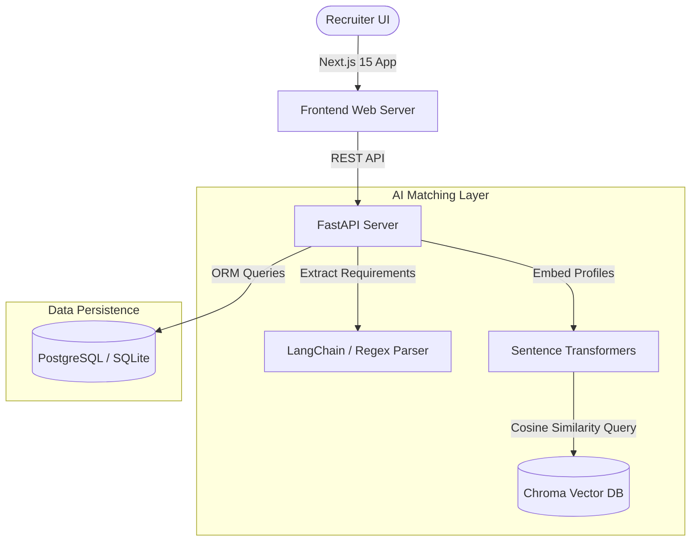
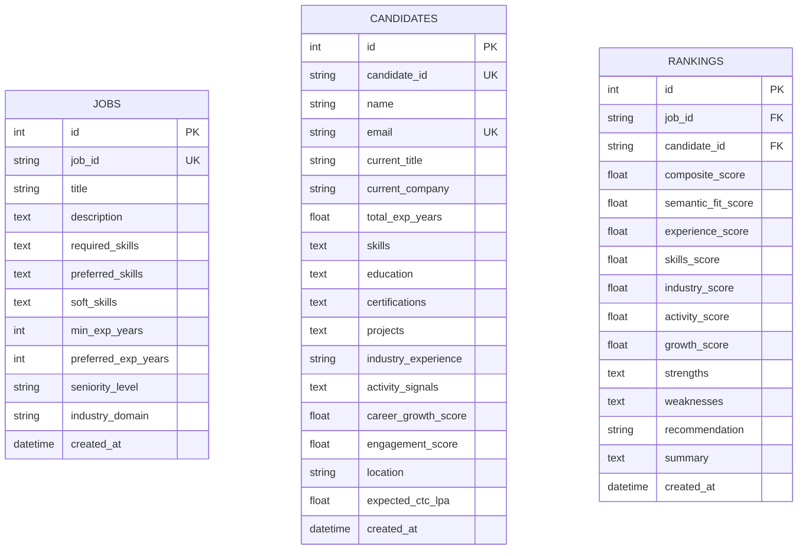

# TalentMind AI — Intelligent Candidate Discovery

A production-quality AI recruiting, candidate discovery, and multi-signal ranking platform. It understands job descriptions deeply, evaluates candidates semantically, incorporates work history metadata/behavioral signals, and delivers a ranked leaderboard with explainable AI summaries.

---

## 🏗️ Architecture



---

## 📊 Entity Relationship (ER) Diagram



---

## 📡 API Documentation

| Endpoint | Method | Description |
|---|---|---|
| `/api/jobs/upload` | `POST` | Upload and parse job description text |
| `/api/candidates/upload` | `POST` | Upload and seed candidate profiles CSV |
| `/api/rank` | `POST` | Rank candidate pool against job description with weights tuning |
| `/api/candidates` | `GET` | Get all candidates list |
| `/api/jobs` | `GET` | Get all job roles |
| `/api/rankings` | `GET` | Get current ranking matrix |
| `/api/candidate/{id}` | `GET` | Get detailed candidate profile and ranking history |
| `/api/download/{format}`| `GET` | Export current ranked leaderboard in `csv` or `xlsx` format |

---

## 🛠️ Setup & Execution

### Option 1: Docker Compose (Recommended)

1. Clone or navigate to the directory:
   ```bash
   cd talentmind-ai
   ```
2. Build and run containers (FastAPI, Next.js, PostgreSQL, ChromaDB):
   ```bash
   docker-compose up --build
   ```
3. Seed sample data:
   * Execute seed command inside backend container:
     ```bash
     docker exec -it talentmind-backend python data/seed.py
     ```
4. Access App:
   * **Web UI**: `http://localhost:3000`
   * **API Docs**: `http://localhost:8000/docs`

---

### Option 2: Local Host Development Run

#### Backend Setup
1. Navigate to backend:
   ```bash
   cd backend
   ```
2. Install dependencies:
   ```bash
   pip install -r requirements.txt
   ```
3. Run migrations and seed data:
   ```bash
   python data/seed.py
   ```
4. Start server:
   ```bash
   uvicorn app.main:app --host 0.0.0.0 --port 8000 --reload
   ```

#### Frontend Setup
1. Navigate to frontend:
   ```bash
   cd frontend
   ```
2. Install dependencies:
   ```bash
   npm install
   ```
3. Run Next.js:
   ```bash
   npm run dev
   ```
4. Open your browser and navigate to `http://localhost:3000`.
